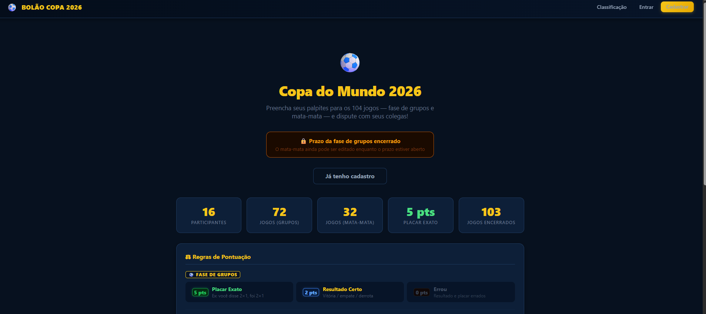
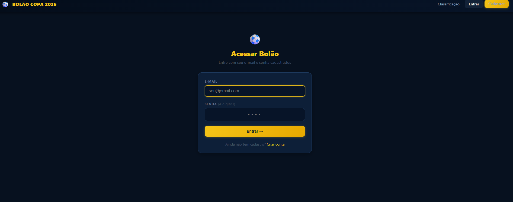
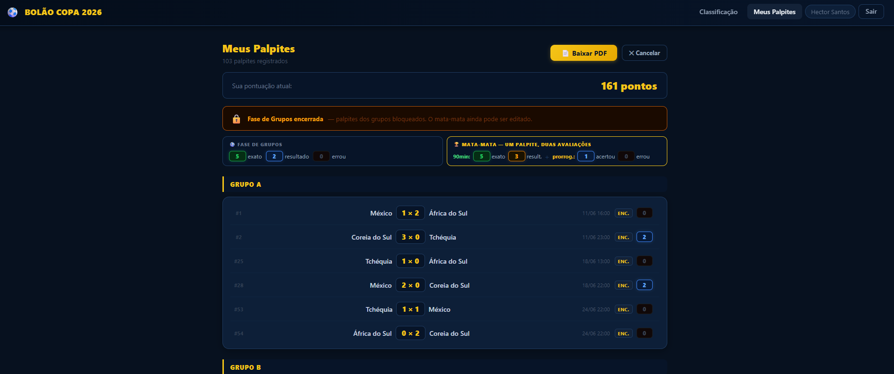

# ⚽ Bolão Copa do Mundo 2026

Sistema desenvolvido para gerenciamento de um bolão entre amigos durante a Copa do Mundo FIFA 2026.

O sistema permite que os participantes realizem seus palpites para todos os jogos da competição, desde a fase de grupos até a grande final, gerando automaticamente a pontuação de acordo com as regras estabelecidas.

---

## 📷 Demonstração





---

# 🚀 Funcionalidades

- Cadastro de usuários
- Login
- Cadastro de palpites
- Palpites da fase de grupos
- Palpites do mata-mata
- Classificação dos participantes
- Ranking em tempo real
- Cálculo automático da pontuação
- Administração dos jogos
- Atualização automática da classificação

---

# ⚽ Regras da Pontuação

## 🟢 Fase de Grupos

| Situação | Pontuação |
|----------|----------:|
| Acertar o placar exato | ⭐ 5 pontos |
| Acertar apenas o vencedor ou empate | ⭐ 2 pontos |

---

## 🔴 Mata-mata (90 minutos)

| Situação | Pontuação |
|----------|----------:|
| Acertar o placar exato | ⭐ 5 pontos |
| Acertar o vencedor nos 90 minutos | ⭐ 3 pontos |

---

## ⏱️ Jogos decididos na prorrogação

| Situação | Pontuação |
|----------|----------:|
| Acertar o placar exato da prorrogação | ⭐ 2 pontos |
| Acertar apenas o vencedor | ⭐ 1 ponto |

---

# 🛠 Tecnologias utilizadas

| Tecnologia | Finalidade           |
| ---------- | -------------------- |
| Python     | Linguagem principal  |
| Flask      | Framework Web        |
| SQLite     | Banco de dados local |
| HTML       | Interface            |
| FPDF       | Geração de PDFs      |
| Git        | Controle de versão   |


---

## 📁 Estrutura do Projeto

```text
Bolao/
│
├── app.py
├── bolao.db
├── README.md
├── COMO-USAR.md
│
├── templates/
│   ├── admin_login.html
│   ├── admin_jogadores.html
│   ├── admin_jogos.html
│   └── ...
│
├── image/
│   ├── Login.png
│   ├── tela-inicial.png
│   └── palpite.png
│
└── .git/
```

---

# ▶️ Como executar

## 1 - Clonar o projeto

```bash
git clone https://github.com/HectorCardoso93/bolao-copa.git
```

## 2 - Abrir no Visual Studio

Abra a solução (.sln)

## 3 - Configurar o banco

Atualize a string de conexão no arquivo:

```text
appsettings.json
```

ou

```text
Conexao.cs
```

(dependendo da estrutura do projeto)

## 4 - Executar

Pressione **F5**.

---

# 📊 Fluxo do Sistema

Usuário

↓

Tela Login

↓

Autenticação

↓

Tela Inicial

↓

Escolhe um jogo

↓

Registra placar

↓

Banco SQLite

↓

Administrador informa resultado oficial

↓

Sistema calcula pontuação

↓

Ranking atualizado

↓

Exportação PDF

---

# 🎯 Objetivo

O projeto é uma aplicação web para gerenciamento de um bolão da Copa do Mundo 2026.

---

# 📌 Melhorias Futuras

- Ranking em tempo real
- Dashboard com estatísticas
- Notificações de jogos
- Exportação do ranking em PDF
- Cadastro de campeonatos
- Área administrativa completa
- Histórico de edições dos palpites
- Tema escuro

---

# 👨‍💻 Autor

**Hector Cardoso dos Santos**

LinkedIn:

GitHub:
https://github.com/HectorCardoso93
